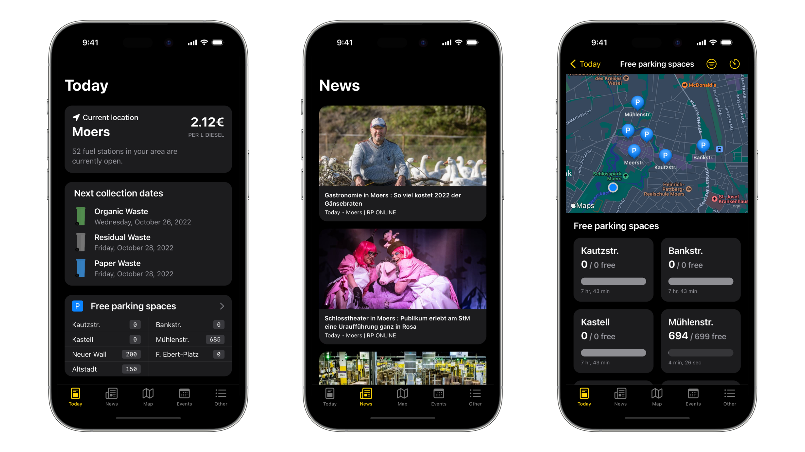

# Mein Moers for iOS

<p align="left">
<a href="https://moers.app">
    
</a>
<a href="https://apps.apple.com/us/app/24doors/id1580211646">
    
</a>
<a href="https://play.google.com/store/apps/details?id=com.lambdadigamma.moers">
    
</a>
</p>

The official [Mein Moers](https://moers.app) app for iOS.

## Run locally during development

### Prerequisits

Make sure that you have installed:

- Xcode 14.0

Clone the repository from GitHub:

```bash
git clone https://github.com/LambdaDigamma/moers-ios.git
```

### API Keys

#### Tankerkoenig

Register for an api token on [tankerkoenig.de](https://creativecommons.tankerkoenig.de) and copy the file `Tankerkoenig-Info-Sample.plist` to `Tankerkoenig-Info.plist` and enter your new api token.

#### Firebase

Please be aware that this app is using Firebase for error tracking. 
You may need to setup a Firebase project to run this project locally.

> **Note**
>
> We are working on a development scheme that uses only static data services so that we can achieve better test coverage and generate marketing material.

<!-- Then checkout the instructions on how to run each app locally: [iOS](ios/README.md) & [Android](android/README.md) -->

## Features

♻️  **Access waste schedule** with notifications and widgets <br>
⛽️  **Compare fuel prices** to other fuel stations and quickly navigate there <br>
🅿️  **Find parking areas** and keep track of your parking timer<br>
📰  **Read news** from the local news provider<br>
📻  **Access information** about the local radio station<br>
🎤  **Find interesting events** in your area<br>
🗺  **Spot a restaurant** near you<br>
🚌  **Find connections** to your destination

## Issues

If you find any problems or want to track issues, please use the issues feature or start a discussion in the Discussions tab.

## Deployment

Most of the tedious bookkeeping and deployment work is automated via [fastlane](https://fastlane.tools).<br>
A list of the available fastlane lanes can be found [here](fastlane/README.md).

## Ideas

If you have any other ideas that you want to quickly note, please add them to [IDEAS.md](IDEAS.md).


## GitHub Secrets

ANDROID_KEYSTORE_FILE
ANDROID_KEYSTORE_KEY_ALIAS
ANDROID_KEYSTORE_KEY_PASSWORD
ANDROID_KEYSTORE_STORE_PASSWORD
ANDROID_PLAY_CONFIG_JSON

<br>
<br>

---

<p align="left">
<a href="https://appstoreconnect.apple.com/apps/1305862555/appstore/ios/">
    
</a>
<!-- <a href="">
    
</a> -->
</p>
